---
# Front matter
lang: ru-RU
title: "Лабораторная работа №1"
subtitle: "Изучение git и markdown"
author: "Астафьева Анна Андреевна, НПИбд-01-18"

# Formatting
toc-title: "Содержание"
toc: true # Table of contents
toc_depth: 2
lof: true # List of figures
lot: true # List of tables
fontsize: 12pt
linestretch: 1.5
papersize: a4paper
documentclass: scrreprt
polyglossia-lang: russian
polyglossia-otherlangs: english
mainfont: PT Serif
romanfont: PT Serif
sansfont: PT Sans
monofont: PT Mono
mainfontoptions: Ligatures=TeX
romanfontoptions: Ligatures=TeX
sansfontoptions: Ligatures=TeX,Scale=MatchLowercase
monofontoptions: Scale=MatchLowercase
indent: true
pdf-engine: lualatex
header-includes:
  - \linepenalty=10 # the penalty added to the badness of each line within a paragraph (no associated penalty node) Increasing the value makes tex try to have fewer lines in the paragraph.
  - \interlinepenalty=0 # value of the penalty (node) added after each line of a paragraph.
  - \hyphenpenalty=50 # the penalty for line breaking at an automatically inserted hyphen
  - \exhyphenpenalty=50 # the penalty for line breaking at an explicit hyphen
  - \binoppenalty=700 # the penalty for breaking a line at a binary operator
  - \relpenalty=500 # the penalty for breaking a line at a relation
  - \clubpenalty=150 # extra penalty for breaking after first line of a paragraph
  - \widowpenalty=150 # extra penalty for breaking before last line of a paragraph
  - \displaywidowpenalty=50 # extra penalty for breaking before last line before a display math
  - \brokenpenalty=100 # extra penalty for page breaking after a hyphenated line
  - \predisplaypenalty=10000 # penalty for breaking before a display
  - \postdisplaypenalty=0 # penalty for breaking after a display
  - \floatingpenalty = 20000 # penalty for splitting an insertion (can only be split footnote in standard LaTeX)
  - \raggedbottom # or \flushbottom
  - \usepackage{float} # keep figures where there are in the text
  - \floatplacement{figure}{H} # keep figures where there are in the text
---

# Цель работы

Цель работы --- подготовка оборудования для последующих лабораторных работ, знакомство с git и markdown.

# Задание

1. Установить git и ознакомиться с основными возможностями.
2. Выполнить отчет в формате Mardown.

# Выполнение лабораторной работы

Работа выполнялась в 2 этапа: 
1. Знакомство и изучение git 
2. Знакомство с markdown и создание отчета.

Так как у меня установлена операционная система Windows, для работы с git я использовала Git for Windows (mSysGit).

## Знакомство с Git
### Теоретические сведения
Git — распределённая система управления версиями. 

Система спроектирована как набор программ, специально разработанных с учётом их использования в сценариях. Это позволяет удобно создавать специализированные системы контроля версий на базе Git или пользовательские интерфейсы.

Ядро Git представляет собой набор утилит командной строки с параметрами. Все настройки хранятся в текстовых файлах конфигурации. Такая реализация делает Git легко портируемым на любую платформу и даёт возможность легко интегрировать Git в другие системы (в частности, создавать графические git-клиенты с любым желаемым интерфейсом).

Репозиторий Git представляет собой каталог файловой системы, в котором находятся файлы конфигурации репозитория, файлы журналов, хранящие операции, выполняемые над репозиторием, индекс, описывающий расположение файлов, и хранилище, содержащее собственно файлы. 

По умолчанию репозиторий хранится в подкаталоге с названием «.git» в корневом каталоге рабочей копии дерева файлов, хранящегося в репозитории.

Любой файл в директории существующего репозитория может находиться или не находиться под версионным контролем (отслеживаемые и неотслеживаемые).

Отслеживаемые файлы могут быть в 3-х состояниях: неизменённые, изменённые, проиндексированные (готовые к коммиту).

Основные команды:

-**git init**  
Создает новый проект

-**git add**  
Добавляет содержимое рабочей директории в индекс (staging area) для последующего коммита.

-**git status**  
Показывает состояния файлов в рабочей директории и индексе: какие файлы изменены, но не добавлены в индекс; какие ожидают коммита в индексе. 

-**git commit**  
Берёт все данные, добавленные в индекс с помощью git add, и сохраняет их слепок во внутренней базе данных, а затем сдвигает указатель текущей ветки на этот слепок.

-**git reset**  
Используется в основном для отмены изменений. Она изменяет указатель HEAD и, опционально, состояние индекса.

-**git clone**  
Клонирует удаленный репозиторий

### Ход выполнения
1. Установка имени и электронной почты    
Задаю имя "Anna" и электронную почту "annastafeva@bk.ru" (рис. fig:001).
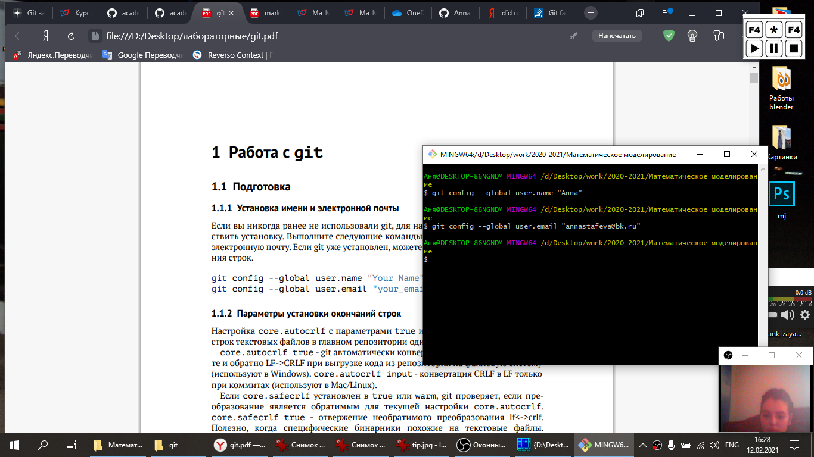{ #fig:001 width=70% }  

2. Установка параметров окончаний строк  
Устанавливаю все переводы строк текстовых файлов в главном репозитории одинаковыми.  
Устанавливаю проверку обратимости преобразования для текущей настройки core.autocrlf, печать только предупреждения (рис. #fig:002).  
{ #fig:002 width=70% }

3. Установка отображения unicode  
Что бы избежать нечитаемых строк, устанавливаю соответствующий флаг (рис. #fig:003).  
{ #fig:003 width=70% }

4. Создание репозитория  
Создаю git репозиторий из каталога laboratory, основного каталога с работами по Математическому моделированию (рис. #fig:004).  
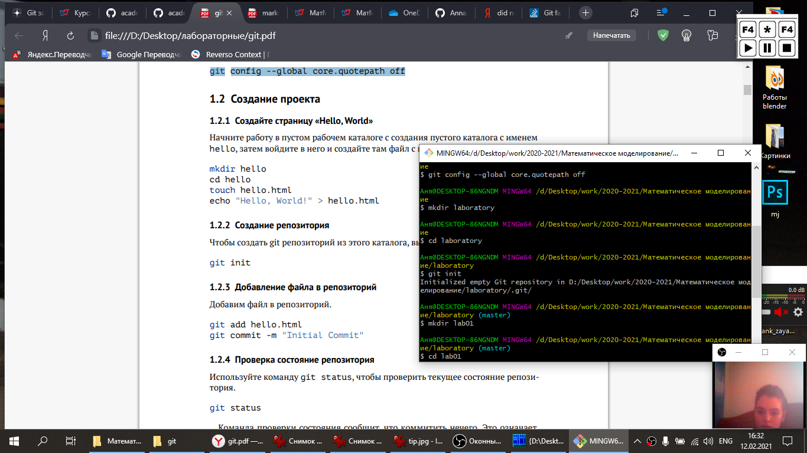{ #fig:004 width=70% }

5. Изучение некоторых команд git  
Создаю папку lab01 для первой лабораторной работы. В ней создаю файл hello.html с текстом (рис. #fig:005).

Добавляю файл в репозиторий git, сначала добавляя в индекс, потом сохраняя (рис. #fig:006).

Изменяю файл и проверяю статус. Изменения не зафиксированы в репозитории (рис. #fig:007).

Индексирую изменения и проверяю статус. Иземенения еще не записаны (рис. #fig:008).

Делаю коммит без метки комментария и записываю комментарий через редактор. Проверяю статус. Рабочий каталог чист (рис. #fig:009).

Просматриваю список произведенных изменений в разных форматах(рис. #fig:010), (рис. #fig:011).

Перемещаюсь по версиям (рис. #fig:012), (рис. #fig:013).

Создаю теги версиям (рис. #fig:014), (рис. #fig:015).

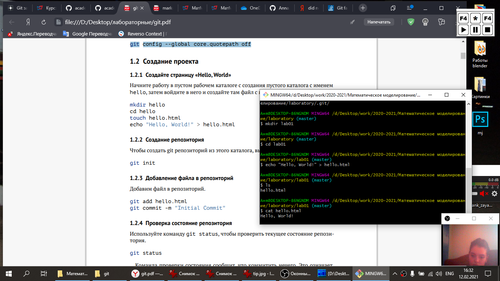{ #fig:005 width=70% }  
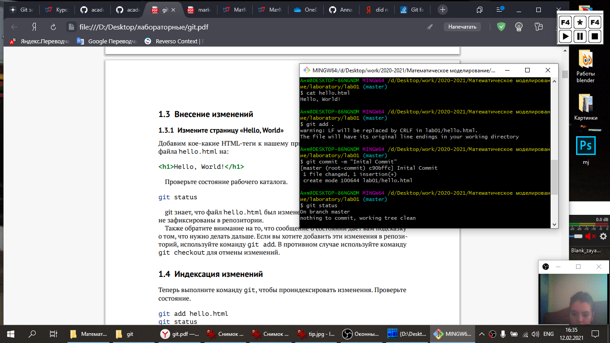{ #fig:006 width=70% }  
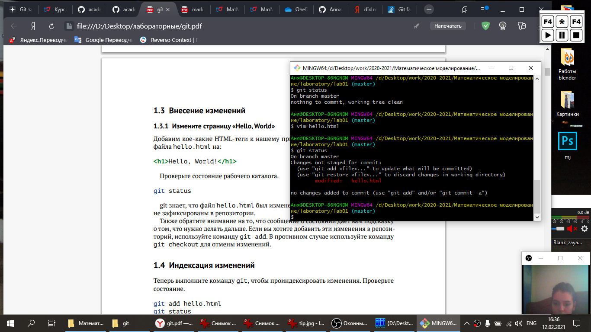{ #fig:007 width=70% }  
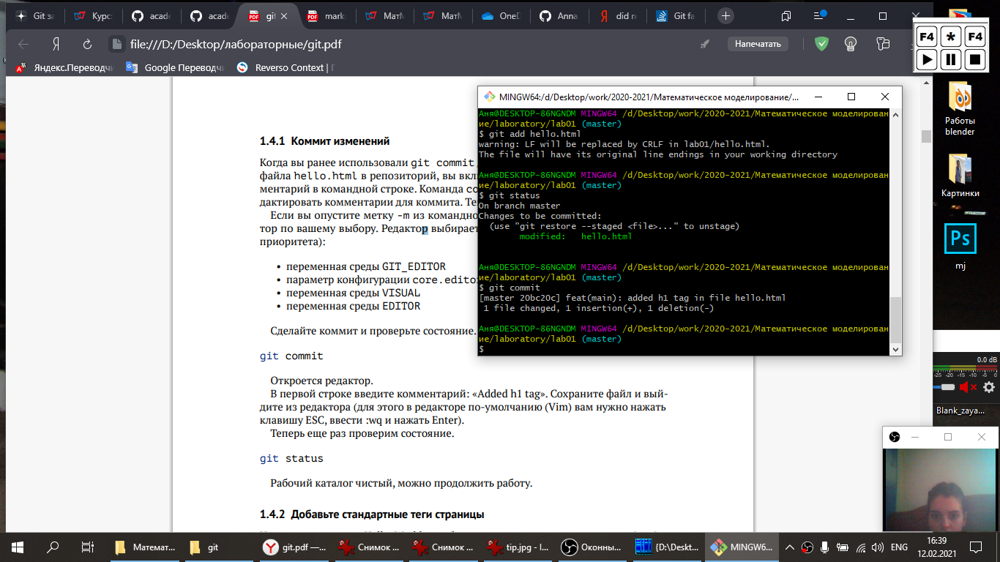{ #fig:008 width=70% }  
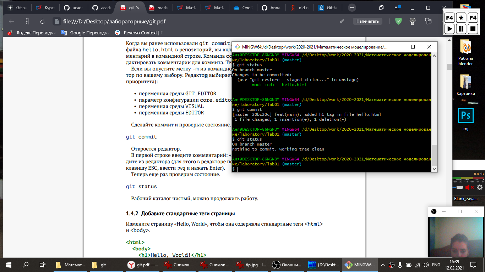{ #fig:009 width=70% }  
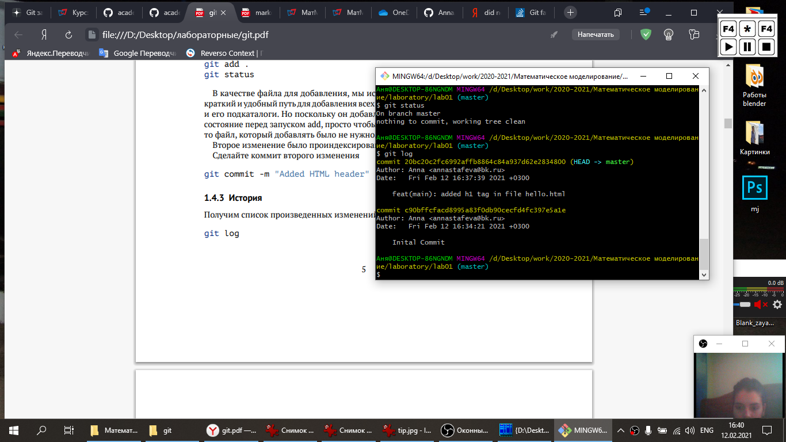{ #fig:010 width=70% }  
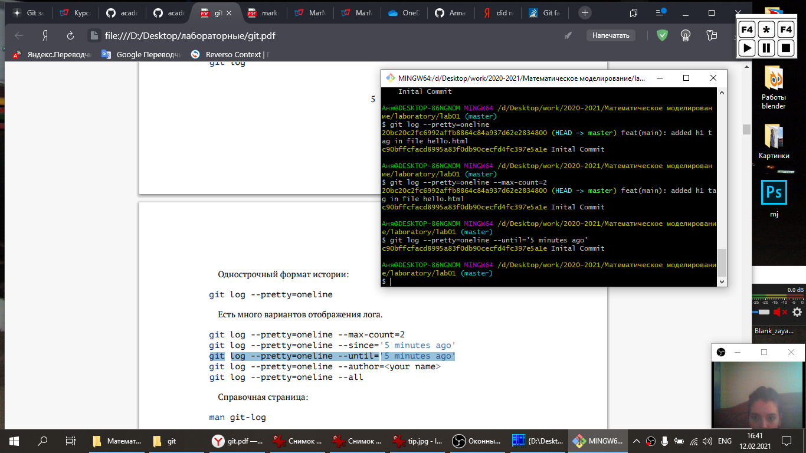{ #fig:011 width=70% }  
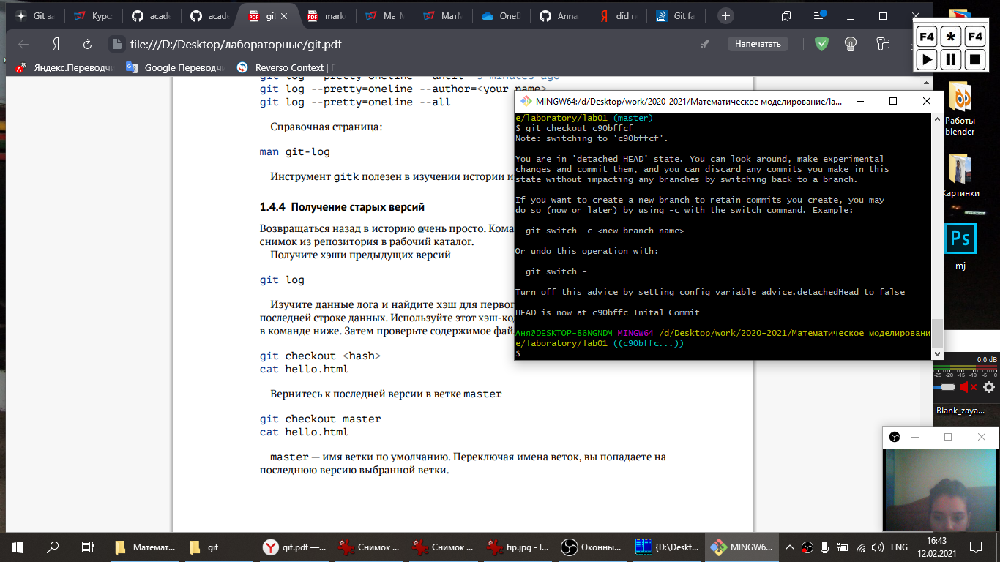{ #fig:012 width=70% }  
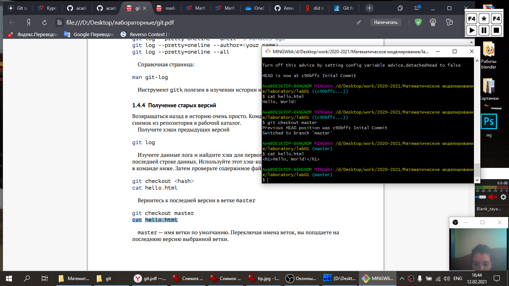{ #fig:013 width=70% }  
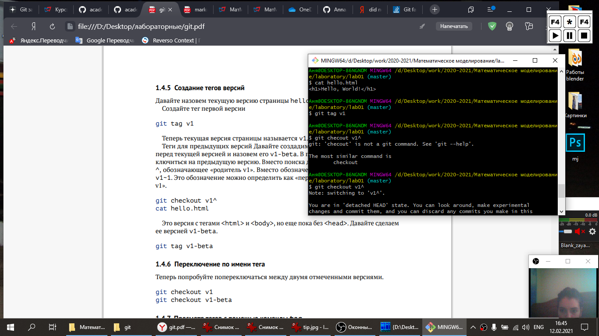{ #fig:014 width=70% }  
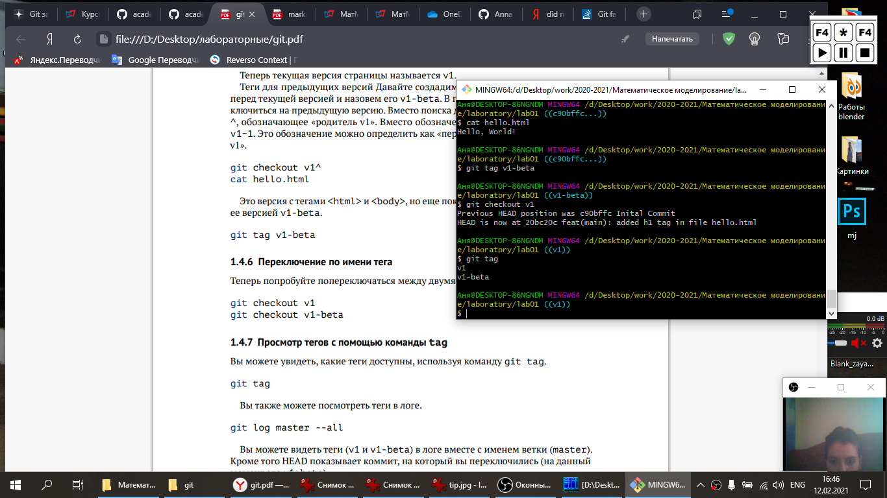{ #fig:015 width=70% }  

6. Подключение удаленного репозитория на GitHub.  
Связываю репозиторий с репозиторием на GitHub (рис. #fig:016).  
В главном каталоге создаю файл README.md и добавляю его в репозиторий, обнавляю данные в удаленном репозитории (рис. #fig:017).  
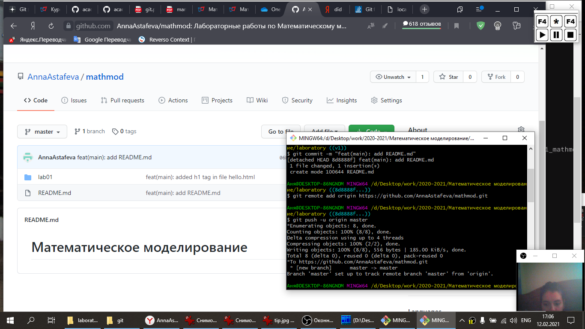{ #fig:016 width=70% }  
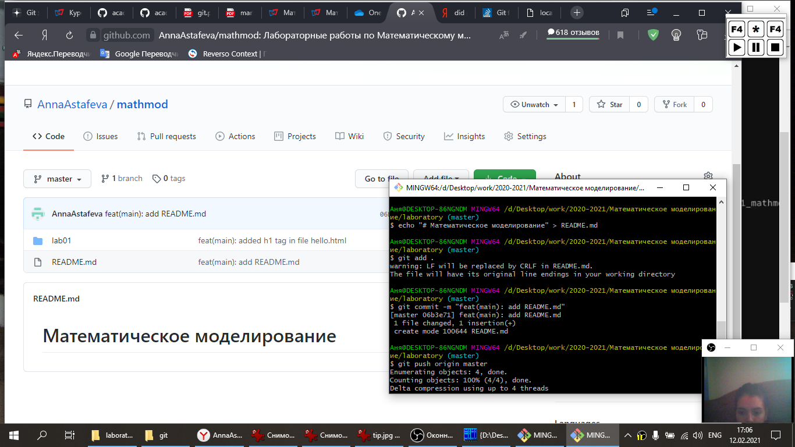{ #fig:017 width=70% }  

7. Скачивание шаблонов для отчета и презентации  
Скачиваю шаблоны и добавляю их в свой репозиторий (рис. #fig:018), (рис. #fig:019).    
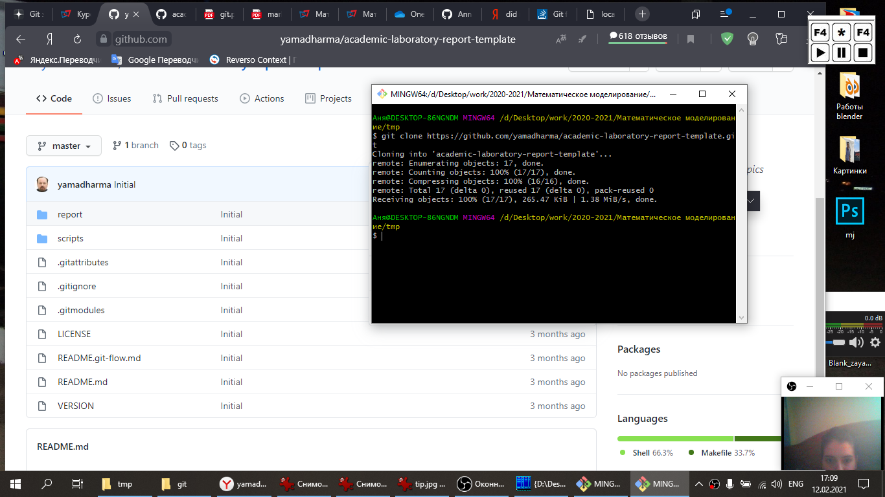 { #fig:018 width=70% }  
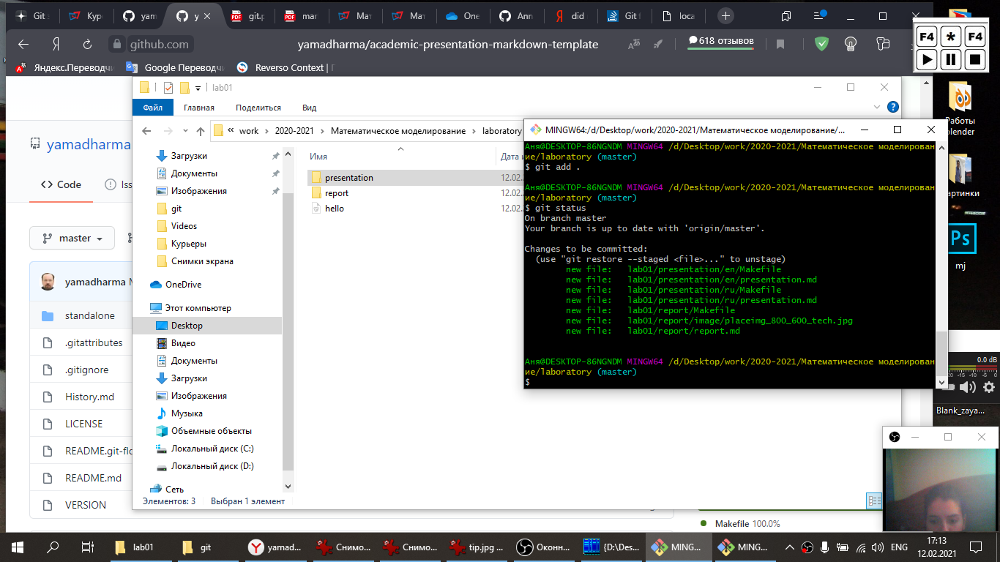 { #fig:019 width=70% }  

## Знакомство с Markdown
### Теоритические сведения  
Markdown — облегчённый язык разметки, созданный с целью обозначения форматирования в простом тексте, с максимальным сохранением его читаемости человеком, и пригодный для машинного преобразования в языки для продвинутых публикаций.

### Создание отчета
Открываю файл шаблона report.md и создаю свой отчет (рис. #fig:020).  
Для отработки файлов используется программа pandoc.  
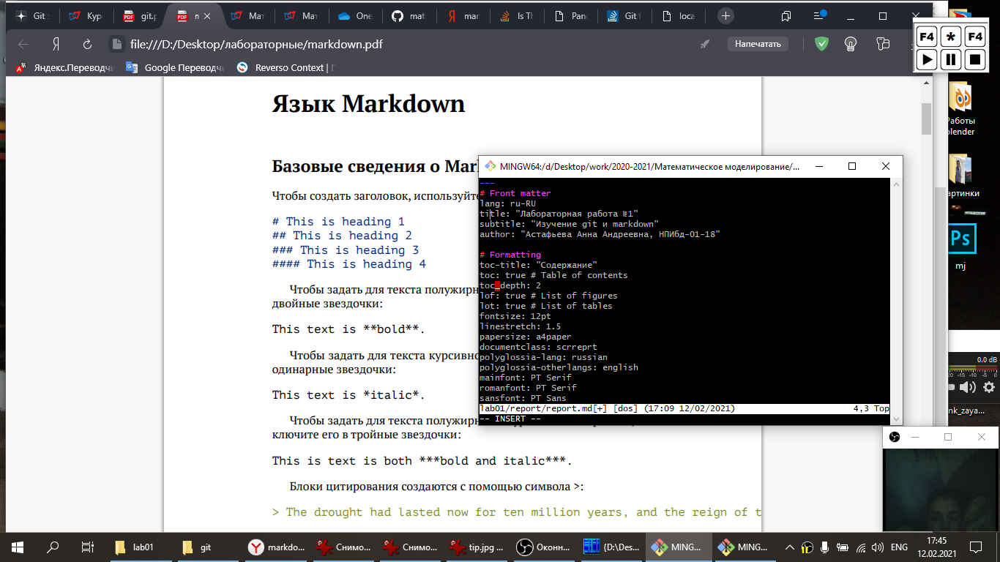{ #fig:020 width=70% }

# Выводы

Изучены основные возможности git и markdown.
