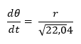

---
## Front matter
lang: ru-RU
title: Лабораторная работа №2
author: |
	Anna A. Astafeva\inst{1}
institute: |
	\inst{1}RUDN University, Moscow, Russian Federation
date: NEC--2021, 13 February, 2021 Moscow, Russia

## Formatting
toc: false
slide_level: 2
theme: metropolis
header-includes: 
 - \metroset{progressbar=frametitle,sectionpage=progressbar,numbering=fraction}
 - '\makeatletter'
 - '\beamer@ignorenonframefalse'
 - '\makeatother'
aspectratio: 43
section-titles: true
---

# Цели и задачи 

## Цель работы

Цель работы - построение математической модели для решения задачи о погоне.

## Задача о погоне

**Вариант 41**

На море в тумане катер береговой охраны преследует лодку браконьеров.
Через определенный промежуток времени туман рассеивается, и лодка
обнаруживается на расстоянии 17,4 км от катера. Затем лодка снова скрывается в
тумане и уходит прямолинейно в неизвестном направлении. Известно, что скорость
катера в 4,8 раза больше скорости браконьерской лодки.

## Задание

1. Запишисать уравнение, описывающее движение катера, с начальными
условиями для двух случаев (в зависимости от расположения катера
относительно лодки в начальный момент времени).
2. Построить траекторию движения катера и лодки для двух случаев.
3. Найти точку пересечения траектории катера и лодки.

# Ход выполнения работы

## Решение задачи

Решение исходной задачи сводится к решению дифференциального уравнения (рис. -@fig:001).    

{ #fig:001 width=70% }

с начальными условиями  (&#1012;~0~=0, r~0~=17.4/5.8) или (&#1012;~0~=-&#960;, r~0~=17.4/3.8).

## Случай 1

Точка пересечения - (6,85;-6,85) (рис. -@fig:002).    

{ #fig:002 width=50% }

## Случай 2

Точка пересечения - (20,5;-20,5) (рис. -@fig:003).    

{ #fig:003 width=50% }

# Вывод

В ходе выполнения лабораторной работы я научилась решать задачу о погоне с помощью моделирования.

## {.standout}

Спасибо за внимание!
