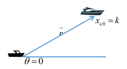
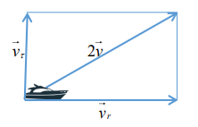
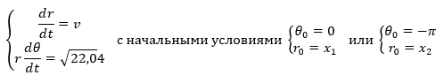
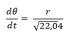
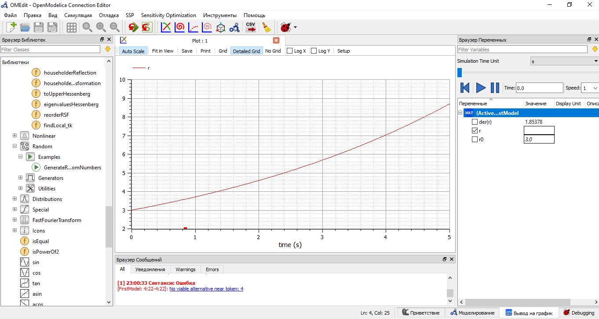
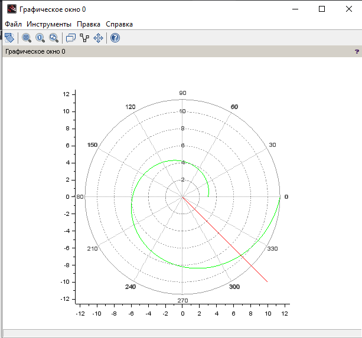
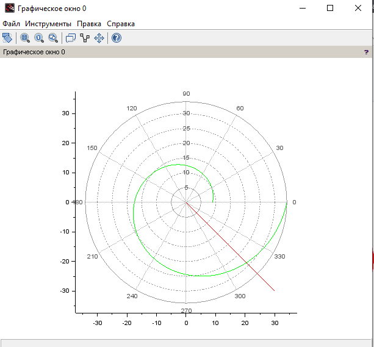

---
# Front matter
lang: ru-RU
title: "Лабораторная работа №2"
subtitle: "Задача о погоне"
author: "Астафьева Анна Андреевна, НПИбд-01-18"

# Formatting
toc-title: "Содержание"
toc: true # Table of contents
toc_depth: 2
lof: true # List of figures
lot: true # List of tables
fontsize: 12pt
linestretch: 1.5
papersize: a4paper
documentclass: scrreprt
polyglossia-lang: russian
polyglossia-otherlangs: english
mainfontoptions: Ligatures=TeX
romanfontoptions: Ligatures=TeX
sansfontoptions: Ligatures=TeX,Scale=MatchLowercase
monofontoptions: Scale=MatchLowercase
indent: true
pdf-engine: lualatex
header-includes:
  - \linepenalty=10 # the penalty added to the badness of each line within a paragraph (no associated penalty node) Increasing the value makes tex try to have fewer lines in the paragraph.
  - \interlinepenalty=0 # value of the penalty (node) added after each line of a paragraph.
  - \hyphenpenalty=50 # the penalty for line breaking at an automatically inserted hyphen
  - \exhyphenpenalty=50 # the penalty for line breaking at an explicit hyphen
  - \binoppenalty=700 # the penalty for breaking a line at a binary operator
  - \relpenalty=500 # the penalty for breaking a line at a relation
  - \clubpenalty=150 # extra penalty for breaking after first line of a paragraph
  - \widowpenalty=150 # extra penalty for breaking before last line of a paragraph
  - \displaywidowpenalty=50 # extra penalty for breaking before last line before a display math
  - \brokenpenalty=100 # extra penalty for page breaking after a hyphenated line
  - \predisplaypenalty=10000 # penalty for breaking before a display
  - \postdisplaypenalty=0 # penalty for breaking after a display
  - \floatingpenalty = 20000 # penalty for splitting an insertion (can only be split footnote in standard LaTeX)
  - \raggedbottom # or \flushbottom
  - \usepackage{float} # keep figures where there are in the text
  - \floatplacement{figure}{H} # keep figures where there are in the text
---

# Цель работы

Цель работы --- построение математической модели для решения задачи о погоне.

# Задача о погоне

**Вариант 41**

На море в тумане катер береговой охраны преследует лодку браконьеров.
Через определенный промежуток времени туман рассеивается, и лодка
обнаруживается на расстоянии 17,4 км от катера. Затем лодка снова скрывается в
тумане и уходит прямолинейно в неизвестном направлении. Известно, что скорость
катера в 4,8 раза больше скорости браконьерской лодки.

# Задание

1. Запишисать уравнение, описывающее движение катера, с начальными
условиями для двух случаев (в зависимости от расположения катера
относительно лодки в начальный момент времени).
2. Построить траекторию движения катера и лодки для двух случаев.
3. Найти точку пересечения траектории катера и лодки.

# Выполнение лабораторной работы

## Постановка задачи
1. Принимает за *t~0~*=0, *x~л0~*=0 - место нахождения лодки браконьеров в момент обнаружения, *x~к0~*=0 - место нахождения катера береговой охраны относительно лодки браконьеров в момент обнаружения лодки.

2. Введем полярные координаты. Считаем, что полюс - это точка обнаружения лодки браконьеров *x~л0~*(&#1012;=*x~л0~*=0), а полярная ось *r* проходит через точку нахождения катера береговой охраны (рис. -@fig:001).    

{ #fig:001 width=70% }  

  
3. Траектория катера должна быть такой, чтобы и катер, и лодка все время были на одном расстоянии от полюса &#1012;, только в этом случае траектория катера пересечется с траекторией лодки.  
Поэтому для начала катер береговой охраны должен двигаться некоторое время прямолинейно, пока не окажется на том же расстоянии от полюса, что и лодка браконьеров. После этого катер береговой охраны должен двигаться 
вокруг полюса удаляясь от него с той же скоростью, что и лодка браконьеров.

4. Чтобы найти расстояние *x* (расстояние после которого катер начнет двигаться вокруг полюса), необходимо составить простое уравнение. Пусть через время *t* катер и лодка окажутся на одном расстоянии *x* от полюса. За это время лодка пройдет *x*, а катер *k-x* (или *k+x*, в зависимости от начального положения катера относительно полюса). Время, за которое они пройдут это расстояние, вычисляется как *x/v* или *(k-x)/4,8v* (во втором 
случае *(k+v)/4,8v*). Так как время одно и то же, то эти величины одинаковы.  
Тогда неизвестное расстояние *x* можно найти из следующего уравнения:
$\frac{x}{v}=\frac{k+-x}{4,8v}$. Отсюда мы найдем два значения *x~1~*=*k*/5,8 и *x~2~*=*k*/3,8, задачу будем решать для
двух случаев.

5. После того, как катер береговой охраны окажется на одном расстоянии от полюса, что и лодка, он должен сменить прямолинейную траекторию и начать двигаться вокруг полюса удаляясь от него со скоростью лодки *v*.
Для этого скорость катера раскладываем на две составляющие: *v~r~* - радиальная скорость и
*v~t~* - тангенциальная скорость (рис. -@fig:002). Радиальная скорость - это скорость, с которой катер удаляется от полюса, *v~r~*=*dr*/*dt*. Нам нужно, чтобы эта скорость была равна скорости лодки, поэтому полагаем
*dr*/*dt*=*v*.  
Тангенциальная скорость – это линейная скорость вращения катера относительно полюса. Она равна произведению угловой скорости *d*&#1012;/*dt* на радиус
*r*.

{ #fig:002 width=70% }  

  
Из рисунка видно: *v~r~*=&#8730;(23,04*v^2^*-*v^2^*)=*v*&#8730;22,04 (учитывая, что радиальная скорость равна *v*). Тогда получаем *r$\frac{d0}{dt}$=v&#8730;22,04*.

6.  Решение исходной задачи сводится к решению системы из двух дифференциальных уравнений (рис. -@fig:003):

{ #fig:003 width=70% } 

Исключая из полученной системы производную по t, можно перейти к следующему уравнению (рис. -@fig:004):  

{ #fig:004 width=70% }  
 
Начальные условия остаются прежними. Решив это уравнение, получим траекторию движения катера в полярных координатах.

## Моделирование задачи

Изначально планировалось использовать для моделирования язык Modelica, но у меня вызвало затруднение построения в радиальной системе координат в программе OpenModelica. Пример построения траектории движения катера(рис. -@fig:005):  
*model FirstModel  
//parameter Real tan_fi = -1;  
Real r;  
parameter Real r0=17.4/5.8;  
//constant Real pi=2*Modelica.Math.asin(1.0);  
initial equation  
r=r0;  
//tan_fi = Modelica.Math.tan(3*180/4);  
equation  
der(r)=r/sqrt(22.04);  
end FirstModel;*  

{ #fig:005 width=70% }  

В связи с этим я использовала SciLab, на котором был написан пример в лабораторной.

Код в Scilab:  
*s=17.4; // начальное расстояние от лодки до катера*  
*fi=3* * *%pi/4;*

*//функция, описывающая движение катера береговой охраны*  
*function dr=f(tetha, r)*  
*dr=r/sqrt(3);*  
*endfunction;*

*//начальные условия в случае 1*  
*r0=s/5.8;*  
*tetha0=0;*  

*//начальные условия в случае 2*  
*//r0=s/3.8;*  
*//tetha0=-%pi;*  

*tetha=0:0.01:2* * *%pi;*  

*r=ode(r0,tetha0,tetha,f);*  

*//функция, описывающая движение лодки браконьеров*  
*function xt=f2(t)*  
 *xt=tan(fi)* * *t;*  
*endfunction*  

*t=0:1:800;*  

*polarplot(tetha,r,style = color('green')); //построение траектории движения катера в полярных координатах*  
*plot2d(t,f2(t),style = color('red'));*  

Для случая 1 получаем точку пересечения примерно (6,85;-6,85)  (рис. -@fig:006).  

{ #fig:006 width=70% }  

Для случая 2 получаем точку пересечения примерно (20,5; -20,5)  (рис. -@fig:007).  

{ #fig:007 width=70% }

  

# Выводы

В ходе выполнения лабораторной работы я научилась решать задачу о погоне с помощью моделирования.  
