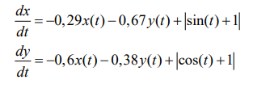
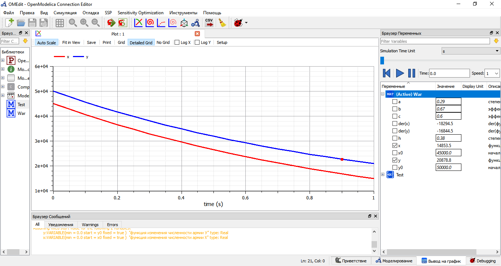
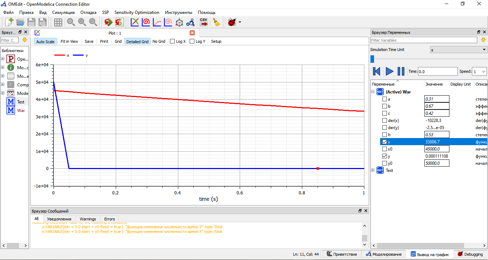

---
## Front matter
lang: ru-RU
title: Лабораторная работа №3
author: |
	Anna A. Astafeva\inst{1}
institute: |
	\inst{1}RUDN University, Moscow, Russian Federation
date: NEC--2021, 13 February, 2021 Moscow, Russia

## Formatting
toc: false
slide_level: 2
theme: metropolis
header-includes: 
 - \metroset{progressbar=frametitle,sectionpage=progressbar,numbering=fraction}
 - '\makeatletter'
 - '\beamer@ignorenonframefalse'
 - '\makeatother'
aspectratio: 43
section-titles: true
---

# Цели и задачи 

## Цель работы

Цель работы - построение модели боевых действий.

## Задание

**Вариант 42**

Между страной *Х* и страной *У* идет война. Численность состава войск исчисляется от начала войны, и являются временными функциями *x(t)* и *y(t)*. В начальный момент времени страна *Х* имеет армию численностью 45 000 человек, а в распоряжении страны *У* армия численностью в 50 000 человек. Для упрощения модели считаем, что коэффициенты *a*, *b*, *c*, *h* постоянны. Также считаем *P(t)* и *Q(t)* непрерывные функции.  
Постройте графики изменения численности войск армии *Х* и армии *У* для следующих случаев:  
1. Модель боевых действий между регулярными войсками.  
2. Модель ведение боевых действий с участием регулярных войск и партизанских отрядов.

# Ход выполнения работы

## Модель боевых действий между регулярными войсками

Модель боевых действий между регулярными войсками можно представить в виде (рис. -@fig:001): 

{ #fig:001 width=70% }

## График изменения численности

Победа армии Y(рис. -@fig:002).

{ #fig:002 width=70% }

## Модель ведение боевых действий с участием регулярных войск и партизанских отрядов

Модель боевых действий между регулярными войсками и партизанскими отрядами можно представить в виде (рис. -@fig:003): 

{ #fig:003 width=70% }

## График изменения численности

Победа армии X(рис. -@fig:004).

{ #fig:004 width=70% }

# Вывод

В ходе выполнения лабораторной работы я смоделировала модели боевых действий между регулярными войсками, а также с участием партизанских отрядов..

## {.standout}

Спасибо за внимание!
