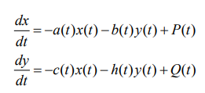
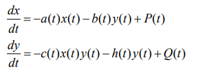
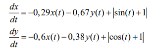
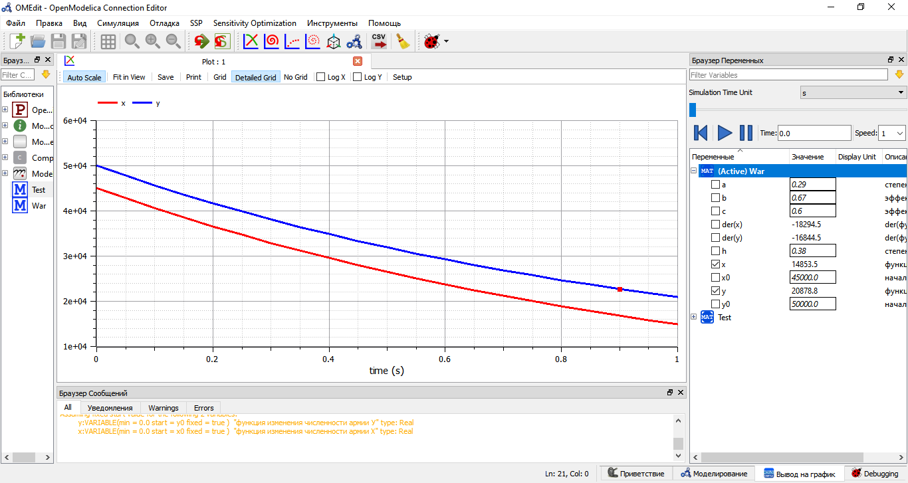
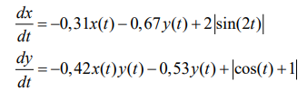
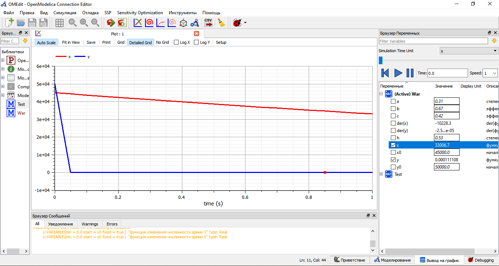

---
# Front matter
lang: ru-RU
title: "Лабораторная работа №3"
subtitle: "Модель боевых действий"
author: "Астафьева Анна Андреевна, НПИбд-01-18"

# Formatting
toc-title: "Содержание"
toc: true # Table of contents
toc_depth: 2
lof: true # List of figures
lot: true # List of tables
fontsize: 12pt
linestretch: 1.5
papersize: a4paper
documentclass: scrreprt
polyglossia-lang: russian
polyglossia-otherlangs: english
mainfont: PT Serif
romanfont: PT Serif
sansfont: PT Sans
monofont: PT Mono
mainfontoptions: Ligatures=TeX
romanfontoptions: Ligatures=TeX
sansfontoptions: Ligatures=TeX,Scale=MatchLowercase
monofontoptions: Scale=MatchLowercase
indent: true
pdf-engine: lualatex
header-includes:
  - \linepenalty=10 # the penalty added to the badness of each line within a paragraph (no associated penalty node) Increasing the value makes tex try to have fewer lines in the paragraph.
  - \interlinepenalty=0 # value of the penalty (node) added after each line of a paragraph.
  - \hyphenpenalty=50 # the penalty for line breaking at an automatically inserted hyphen
  - \exhyphenpenalty=50 # the penalty for line breaking at an explicit hyphen
  - \binoppenalty=700 # the penalty for breaking a line at a binary operator
  - \relpenalty=500 # the penalty for breaking a line at a relation
  - \clubpenalty=150 # extra penalty for breaking after first line of a paragraph
  - \widowpenalty=150 # extra penalty for breaking before last line of a paragraph
  - \displaywidowpenalty=50 # extra penalty for breaking before last line before a display math
  - \brokenpenalty=100 # extra penalty for page breaking after a hyphenated line
  - \predisplaypenalty=10000 # penalty for breaking before a display
  - \postdisplaypenalty=0 # penalty for breaking after a display
  - \floatingpenalty = 20000 # penalty for splitting an insertion (can only be split footnote in standard LaTeX)
  - \raggedbottom # or \flushbottom
  - \usepackage{float} # keep figures where there are in the text
  - \floatplacement{figure}{H} # keep figures where there are in the text
---

# Цель работы

Цель работы --- построение модели боевых действий.

# Задание

**Вариант 42**  

Между страной *Х* и страной *У* идет война. Численность состава войск исчисляется от начала войны, и являются временными функциями *x(t)* и *y(t)*. В начальный момент времени страна *Х* имеет армию численностью 45 000 человек, а в распоряжении страны *У* армия численностью в 50 000 человек. Для упрощения модели считаем, что коэффициенты *a*, *b*, *c*, *h* постоянны. Также считаем *P(t)* и *Q(t)* непрерывные функции.  
  
Постройте графики изменения численности войск армии *Х* и армии *У* для следующих случаев:  
1. Модель боевых действий между регулярными войсками.  (*a* = 0,29, *b* = 0,67, *c* = 0,6, *h* = 0,38, *P(t)* = |*sin(t)* + 1|, *Q(t)* = |*cos(t)* + 1|)  
2. Модель ведение боевых действий с участием регулярных войск и партизанских отрядов.
(*a* = 0,31, *b* = 0,67, *c* = 0,42, *h* = 0,53, *P(t)* = |*sin(2t)* + 1|, *Q(t)* = |*cos(t)* + 1|)

# Выполнение лабораторной работы

## Теоретические сведения
Рассмотрим некоторые простейшие модели боевых действий – модели Ланчестера. В противоборстве могут принимать участие как регулярные войска,
так и партизанские отряды. В общем случае главной характеристикой соперников являются численности сторон. Если в какой-то момент времени одна из
численностей обращается в нуль, то данная сторона считается проигравшей (при условии, что численность другой стороны в данный момент положительна).  
  
Рассмотрим два случая ведения боевых действий:  
1. Боевые действия между регулярными войсками  
2. Боевые действия с участием регулярных войск и партизанских отрядов  
  
В первом случае численность регулярных войск определяется тремя факторами:  
- скорость уменьшения численности войск из-за причин, не связанных с
боевыми действиями (болезни, травмы, дезертирство);  
- скорость потерь, обусловленных боевыми действиями противоборствующих сторон (что связанно с качеством стратегии, уровнем вооружения, профессионализмом солдат и т.п.);  
- скорость поступления подкрепления (задаётся некоторой функцией от
времени).  
  
В этом случае модель боевых действий между регулярными войсками описывается следующим образом (рис. -@fig:001): 

{ #fig:001 width=70% }   

Потери, не связанные с боевыми действиями, описывают члены *-a(t)x(t)* и *-h(t)y(t)*, члены *-b(t)y(y)* и *-c(t)x(t)* отражают потери на поле боя.
Коэффициенты *b(t)* и *c(t)* указывают на эффективность боевых действий со стороны у и х соответственно, *a(t)*, *h(t)* - величины, характеризующие степень влияния различных факторов на потери. Функции *P(t)*, *Q(t)* учитывают возможность подхода подкрепления к войскам *Х* и *У* в течение одного дня.  
  
Во втором случае в борьбу добавляются партизанские отряды. Нерегулярныевойска в отличии от постоянной армии менее уязвимы, так как действуют скрытно,
в этом случае сопернику приходится действовать неизбирательно, по площадям, занимаемым партизанами. Поэтому считается, что тем потерь партизан,
проводящих свои операции в разных местах на некоторой известной территории, пропорционален не только численности армейских соединений, но и численности самих партизан. В результате модель принимает вид (рис. -@fig:002):  

{ #fig:002 width=70% }

В этой системе все величины имеют тот же смысл.  

## Ход выполнения  

Численность армии страны Х -- 45000 человек.  
Численность армии страны У -- 50000 человек.

1. Модель боевых действий между регулярными войсками (рис. -@fig:003): 

{ #fig:003 width=70% }

Моделируем изменение численности армий для боевых действий между регулярными войсками (рис. -@fig:004).

{ #fig:004 width=70% }

**Итог: Победа армии Y.**  
  
Код программы в Modelica:  

model War  

parameter Real a = 0.29"степень влияния различных факторов на потери X";  
parameter Real b = 0.67"эффективность боевых действий со стороны Y";  
parameter Real c = 0.6"эффективность боевых действий со стороны X";  
parameter Real h = 0.38"степень влияния различных факторов на потери Y";  
  
parameter Real x0 = 45000"начальная численность армии X";  
parameter Real y0 = 50000"начальная численность армии Y";  
Real x (start = x0, min = 0)"функция изменения численности армии Х";  
Real y (start = y0, min = 0)"функция изменения численности армии У";  
  
equation  
  
der(x)=-a*x-b*y+abs(sin(time)+1);  
der(y)=-c*x-h*y+abs(cos(time)+1);  
  
end War;  
  

2. Модель ведение боевых действий с участием регулярных войск и партизанских отрядов (рис. -@fig:005): 

{ #fig:005 width=70% }

Моделируем изменение численности армий для боевых действий между регулярными войсками и партизанскими отрядами (рис. -@fig:006).

{ #fig:006 width=70% }

**Итог: Победа армии X.**   
  
Код программы в Modelica:  

model War  
  
parameter Real a = 0.31"степень влияния различных факторов на потери X";  
parameter Real b = 0.67"эффективность боевых действий со стороны Y";  
parameter Real c = 0.42"эффективность боевых действий со стороны X";  
parameter Real h = 0.53"степень влияния различных факторов на потери Y";  
  
parameter Real x0 = 45000"начальная численность армии X";  
parameter Real y0 = 50000"начальная численность армии Y";  
Real x (start = x0, min = 0)"функция изменения численности армии Х";  
Real y (start = y0, min = 0)"функция изменения численности армии У";  
equation  
  
der(x)=-a*x-b*y+2*abs(sin(2*time)+1);  
der(y)=-c*x*y-h*y+abs(cos(time)+1);  
  
end War;  

# Выводы

Я смоделировала модели боевых действий между регулярными войсками, а также с участием партизанских отрядов.  
