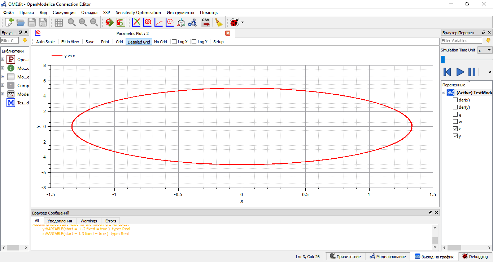
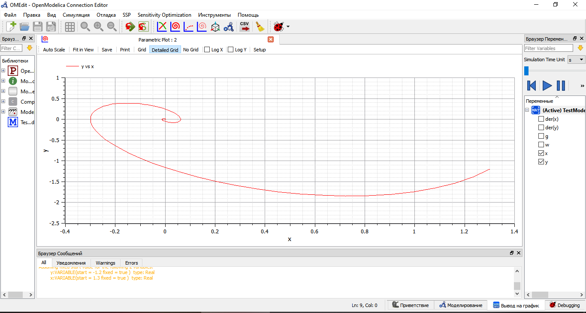
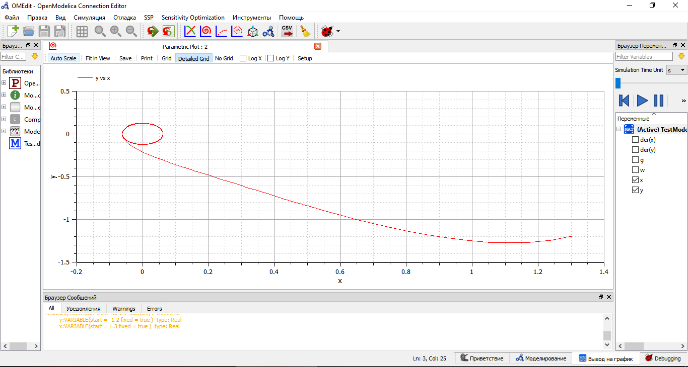

---
## Front matter
lang: ru-RU
title: Лабораторная работа №4
author: |
	Anna A. Astafeva\inst{1}
institute: |
	\inst{1}RUDN University, Moscow, Russian Federation
date: NEC--2021, 13 February, 2021 Moscow, Russia

## Formatting
toc: false
slide_level: 2
theme: metropolis
header-includes: 
 - \metroset{progressbar=frametitle,sectionpage=progressbar,numbering=fraction}
 - '\makeatletter'
 - '\beamer@ignorenonframefalse'
 - '\makeatother'
aspectratio: 43
section-titles: true
---

# Цели и задачи 

## Цель работы

Цель работы - построение модели гармонических колебаний.

## Задание

**Вариант 42**

Постройте фазовый портрет гармонического осциллятора и решение уравнения
гармонического осциллятора для следующих случаев  

1. Колебания гармонического осциллятора без затуханий и без действий внешней
силы x"+14x=0  
2. Колебания гармонического осциллятора c затуханием и без действий внешней
силы x"+2x'+5x=0  
3. Колебания гармонического осциллятора c затуханием и под действием внешней
силы x"+4x'+5x=0.5cos(2t) 

# Построение фазового портрета гармонических колебаний

## Без затуханий и без действий внешней силы

Колебания гармонического осциллятора без затуханий и без действий внешней
силы x"+14x=0 (рис. -@fig:003):  

{ #fig:003 width=70% }

## С затуханием и без действий внешней силы

Колебания гармонического осциллятора c затуханием и без действий внешней
силы x"+2x'+5x=0 (рис. -@fig:004):  

{ #fig:004 width=70% }

## С затуханием и под действием внешней силы

Колебания гармонического осциллятора c затуханием и под действием внешней
силы x"+4x'+5x=0.5cos(2t) (рис. -@fig:005):  

{ #fig:005 width=70% }

# Вывод

В ходе выполнения лабораторной работы я изучила модель линейного гармонического осциллятора, построила фазовые портреты гармонических
колебаний с затуханием и без затухания, с учетом действия внешней силы и без учета действия внешней силы.

## {.standout}

Спасибо за внимание!
