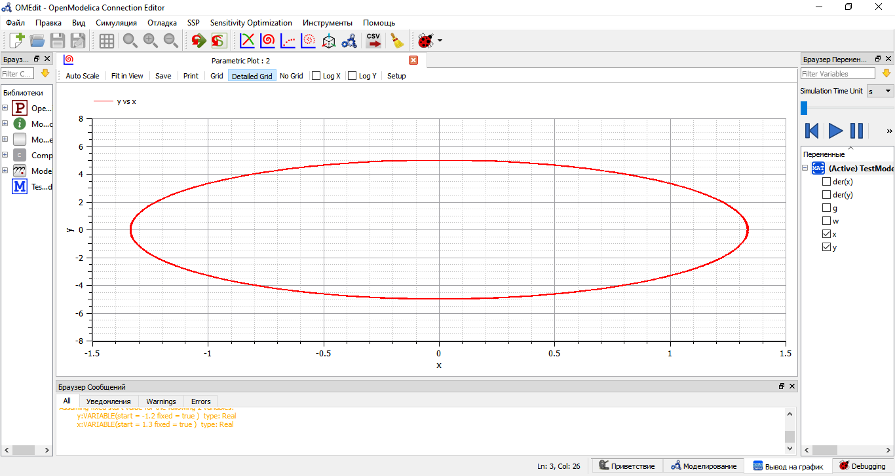
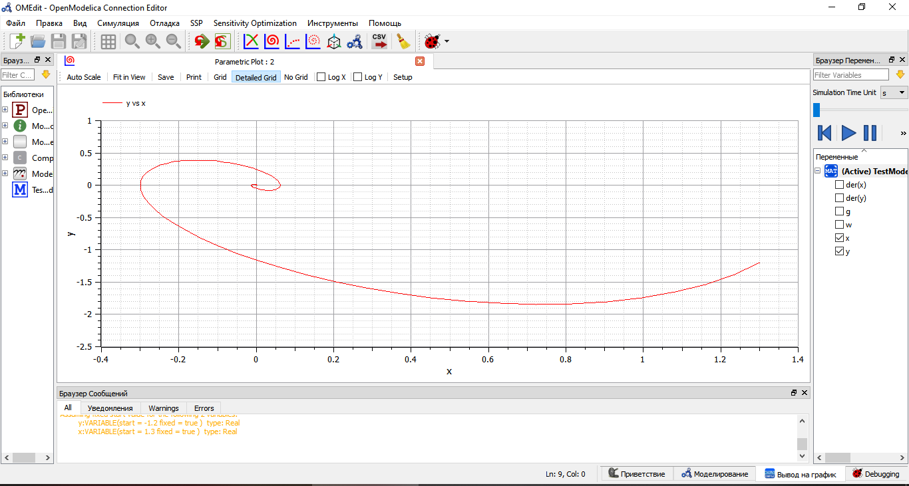
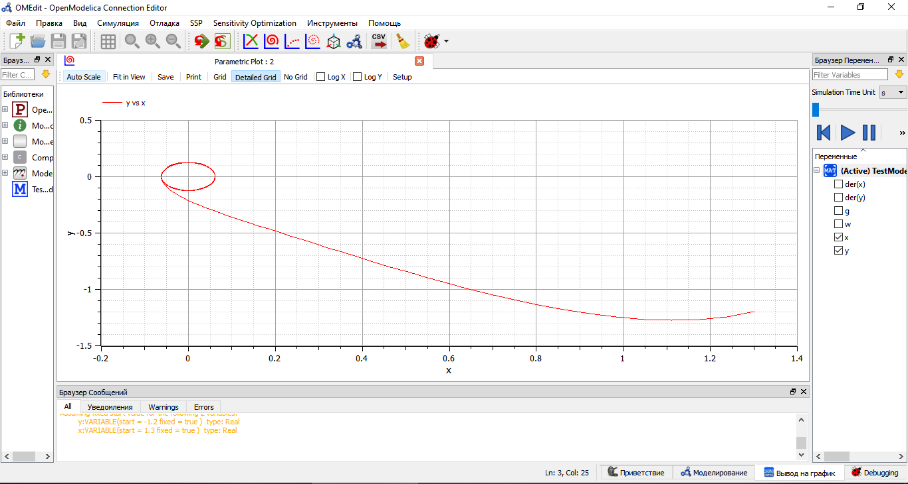

---
# Front matter
lang: ru-RU
title: "Лабораторная работа №4"
subtitle: "Модель гармонических колебаний"
author: "Астафьева Анна Андреевна, НПИбд-01-18"

# Formatting
toc-title: "Содержание"
toc: true # Table of contents
toc_depth: 2
lof: true # List of figures
lot: true # List of tables
fontsize: 12pt
linestretch: 1.5
papersize: a4paper
documentclass: scrreprt
polyglossia-lang: russian
polyglossia-otherlangs: english
mainfont: PT Serif
romanfont: PT Serif
sansfont: PT Sans
monofont: PT Mono
mainfontoptions: Ligatures=TeX
romanfontoptions: Ligatures=TeX
sansfontoptions: Ligatures=TeX,Scale=MatchLowercase
monofontoptions: Scale=MatchLowercase
indent: true
pdf-engine: lualatex
header-includes:
  - \linepenalty=10 # the penalty added to the badness of each line within a paragraph (no associated penalty node) Increasing the value makes tex try to have fewer lines in the paragraph.
  - \interlinepenalty=0 # value of the penalty (node) added after each line of a paragraph.
  - \hyphenpenalty=50 # the penalty for line breaking at an automatically inserted hyphen
  - \exhyphenpenalty=50 # the penalty for line breaking at an explicit hyphen
  - \binoppenalty=700 # the penalty for breaking a line at a binary operator
  - \relpenalty=500 # the penalty for breaking a line at a relation
  - \clubpenalty=150 # extra penalty for breaking after first line of a paragraph
  - \widowpenalty=150 # extra penalty for breaking before last line of a paragraph
  - \displaywidowpenalty=50 # extra penalty for breaking before last line before a display math
  - \brokenpenalty=100 # extra penalty for page breaking after a hyphenated line
  - \predisplaypenalty=10000 # penalty for breaking before a display
  - \postdisplaypenalty=0 # penalty for breaking after a display
  - \floatingpenalty = 20000 # penalty for splitting an insertion (can only be split footnote in standard LaTeX)
  - \raggedbottom # or \flushbottom
  - \usepackage{float} # keep figures where there are in the text
  - \floatplacement{figure}{H} # keep figures where there are in the text
---

# Цель работы

Цель работы --- построение модели гармонических колебаний.

# Задание

**Вариант 42**  

Постройте фазовый портрет гармонического осциллятора и решение уравнения
гармонического осциллятора для следующих случаев  

1. Колебания гармонического осциллятора без затуханий и без действий внешней
силы x"+14x=0  

2. Колебания гармонического осциллятора c затуханием и без действий внешней
силы x"+2x'+5x=0  

3. Колебания гармонического осциллятора c затуханием и под действием внешней
силы x"+4x'+5x=0.5cos(2t)  

# Выполнение лабораторной работы

## Теоретические сведения
Движение грузика на пружинке, маятника, заряда в электрическом контуре, а
также эволюция во времени многих систем в физике, химии, биологии и других
науках при определенных предположениях можно описать одним и тем же
дифференциальным уравнением, которое в теории колебаний выступает в качестве
основной модели. Эта модель называется линейным гармоническим осциллятором.  

Уравнение свободных колебаний гармонического осциллятора имеет
следующий вид:  

x" + 2$γ$x' + $ω_0^2$x = 0	(1)  

где x – переменная, описывающая состояние системы (смещение грузика, заряд конденсатора и т.д.), $γ$ – параметр, характеризующий потери энергии (трение в механической системе, сопротивление в контуре), $ω$~0~ – собственная частота колебаний, t – время.  

Уравнение (1) есть линейное однородное дифференциальное уравнение
второго порядка и оно является примером линейной динамической системы.
При отсутствии потерь в системе ($γ$ = 0) получаем
уравнение консервативного осциллятора энергия колебания которого сохраняется
во времени:  

x" + $ω_0^2$x = 0	(2)  

Независимые переменные x, y определяют пространство, в котором
«движется» решение. Это фазовое пространство системы, поскольку оно двумерно
будем называть его фазовой плоскостью.  

Значение фазовых координат x, y в любой момент времени полностью
определяет состояние системы. Решению уравнения движения как функции
времени отвечает гладкая кривая в фазовой плоскости. Она называется фазовой
траекторией. Если множество различных решений (соответствующих различным 
начальным условиям) изобразить на одной фазовой плоскости, возникает общая
картина поведения системы. Такую картину, образованную набором фазовых
траекторий, называют фазовым портретом.
  

## Ход выполнения  

Построение фазового портрета гармонических колебаний без затухания с использованием среды OpenModelica.  

1. Колебания гармонического осциллятора без затуханий и без действий внешней
силы x"+14x=0 (рис. -@fig:003):  

{ #fig:003 width=70% } 
  
Код программы в Modelica:  

model Occilator  
  
parameter Real w = sqrt(14);  
parameter Real g = 0.0;  
  
Real x(start=1.3);  
Real y(start=-1.2);  
  
equation  
  
der(x) = y;  
der(y) + 2*g*y + w*w*x = 0;  
  
end Occilator;  
  

2. Колебания гармонического осциллятора c затуханием и без действий внешней
силы x"+2x'+5x=0 (рис. -@fig:004):  

{ #fig:004 width=70% } 
  
Код программы в Modelica:  

model Occilator  
  
parameter Real w = sqrt(5);  
parameter Real g = 1.0;  
  
Real x(start=1.3);  
Real y(start=-1.2);  
  
equation  
  
der(x) = y;  
der(y) + 2*g*y + w*w*x = 0;  
  
end Occilator;  
  

3. Колебания гармонического осциллятора c затуханием и под действием внешней
силы x"+4x'+5x=0.5cos(2t) (рис. -@fig:005):  

{ #fig:005 width=70% } 
  
Код программы в Modelica:    

model Occilator  
  
parameter Real w = sqrt(5);  
parameter Real g = 2.0;  
  
Real x(start=1.3);  
Real y(start=-1.2);  
  
equation  
  
der(x) = y;  
der(y) + 2*g*y + w*w*x = 0.5*cos(2.0 * time);  
  
end Occilator;  
  

# Вопросы к лабораторной работе

1. Запишите простейшую модель гармонических колебаний  

x" + $ω_0^2$x = 0

2. Дайте определение осциллятора  

**Осциллятор** (лат. oscillo — качаюсь) — система, совершающая колебания, то есть показатели которой периодически повторяются во времени.  

3. Запишите модель математического маятника  

x" + $γ$x' + $ω_0^2$x = f(t)

4. Запишите алгоритм перехода от дифференциального уравнения второго порядка к двум дифференциальным уравнениям первого порядка  

Для уравнения второго порядка y" = f(x, y, y') можно получить систему из двуч уравнений первого порядка по принципу:
$$ \begin{cases} y'=y_1 \\ y_1'=f(x, y, y_1) \end{cases} $$

5. Что такое фазовый портрет и фазовая траектория?  

**Фазовый портрет** — общая картина поведения системы, возникающая, если
множество различных решений (соответствующих различным начальным условиям)
изобразить на одной фазовой плоскости.  

**Фазовая траектория** — гладкая кривая в фазовой плоскости, отвечающая решению
уравнения движения как функции времени.  

# Выводы

Я изучила модель линейного гармонического осциллятора, построила фазовые портреты гармонических
колебаний с затуханием и без затухания, с учетом действия внешней силы и без учета действия внешней силы.  
