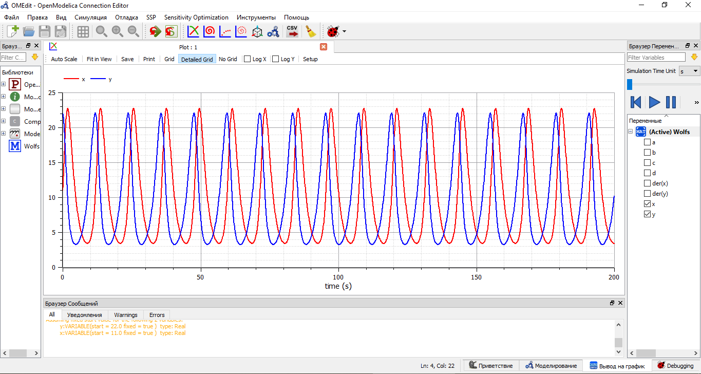
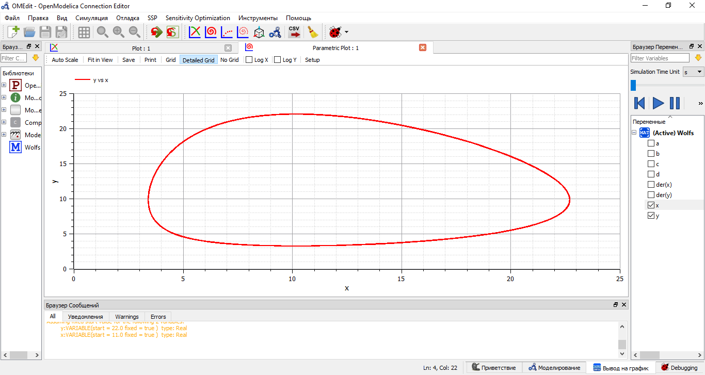
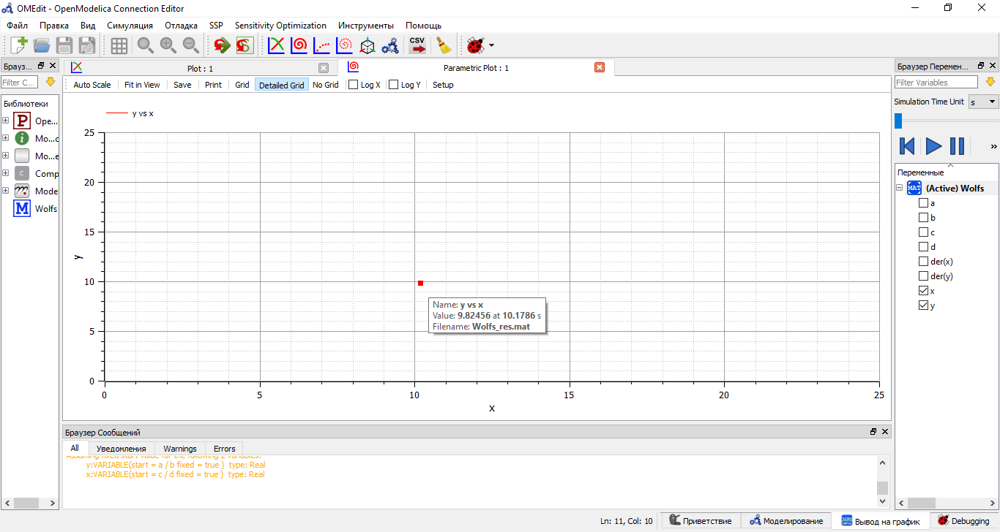

---
## Front matter
lang: ru-RU
title: Лабораторная работа №5
author: |
	Anna A. Astafeva\inst{1}
institute: |
	\inst{1}RUDN University, Moscow, Russian Federation
date: NEC--2021, 13 February, 2021 Moscow, Russia

## Formatting
toc: false
slide_level: 2
theme: metropolis
header-includes: 
 - \metroset{progressbar=frametitle,sectionpage=progressbar,numbering=fraction}
 - '\makeatletter'
 - '\beamer@ignorenonframefalse'
 - '\makeatother'
aspectratio: 43
section-titles: true
---

# Цели и задачи 

## Цель работы

Цель работы --- построение модели хищник-жертва.

## Задание

**Вариант 42**

Для модели «хищник-жертва»:  
$$ \begin{cases} \frac{dx}{dt}=-0.56x(t)+0.057x(t)y(t) \\ \frac{dx}{dt}=0.57x(t)-0.056x(t)y(t) \end{cases} $$  
Постройте график зависимости численности хищников от численности жертв,
а также графики изменения численности хищников и численности жертв при
следующих начальных условиях:
$x_0 = 11, y_0 = 22$. Найдите стационарное
состояние системы.   

# Моделирование взаимодействия двух видов типа «хищник — жертва»

## Колебания изменений численностей популяций

Построение графиков изменения численности хищников (x) и численности жертв (y) (рис. -@fig:002):  

{ #fig:002 width=70% }

## Зависимость численностей популяций

Построение зависимости численности популяций хищников и жертв (фазовый
портрет системы) (рис. -@fig:003):  

{ #fig:003 width=70% } 

## Стационарное состояние
Стационарное состояние находится в точке: $x_0=\frac{0.57}{0.056}=10.179, y_0=\frac{0.56}{0.057}=9.825$ (рис. -@fig:004):  

{ #fig:004 width=70% }

# Вывод

В ходе выполнения лабораторной работы я изучила модель хищник-жертва, построила графики колебаний изменения числа популяций хищников и жертв, а также зависимость изменения численности хищников от изменения численности жертв (фазовый портрет системы).

## {.standout}

Спасибо за внимание!
