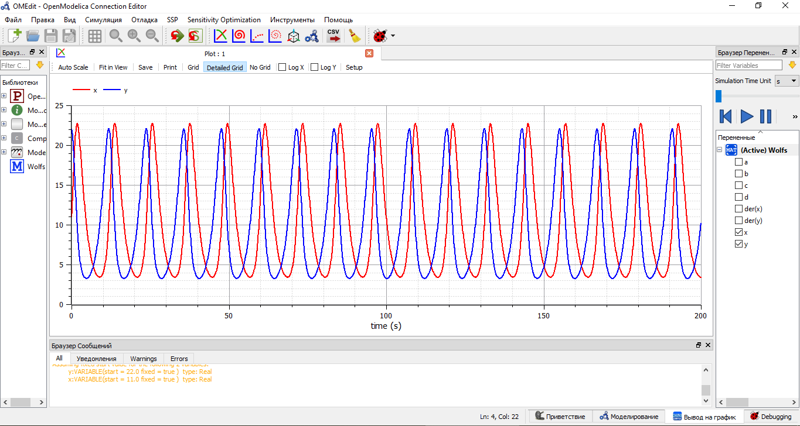
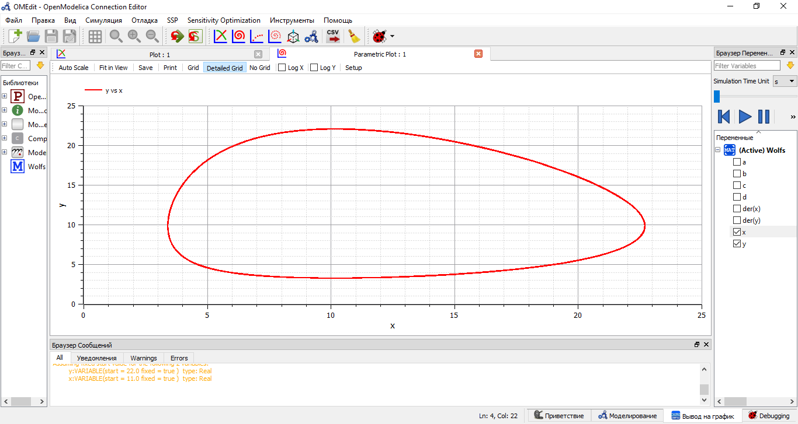
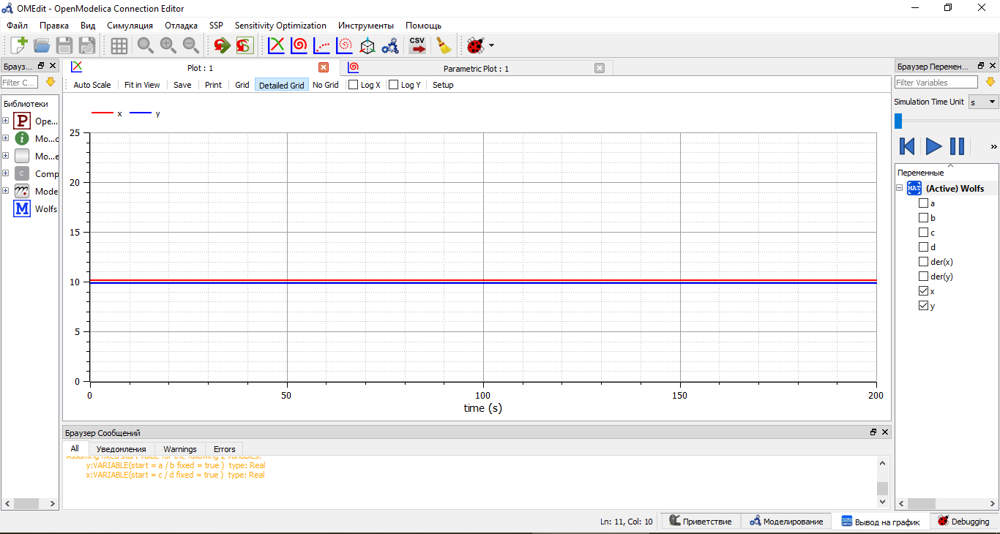

---
# Front matter
lang: ru-RU
title: "Лабораторная работа №5"
subtitle: "Модель хищник-жертва"
author: "Астафьева Анна Андреевна, НПИбд-01-18"

# Formatting
toc-title: "Содержание"
toc: true # Table of contents
toc_depth: 2
lof: true # List of figures
lot: true # List of tables
fontsize: 12pt
linestretch: 1.5
papersize: a4paper
documentclass: scrreprt
polyglossia-lang: russian
polyglossia-otherlangs: english
mainfont: PT Serif
romanfont: PT Serif
sansfont: PT Sans
monofont: PT Mono
mainfontoptions: Ligatures=TeX
romanfontoptions: Ligatures=TeX
sansfontoptions: Ligatures=TeX,Scale=MatchLowercase
monofontoptions: Scale=MatchLowercase
indent: true
pdf-engine: lualatex
header-includes:
  - \linepenalty=10 # the penalty added to the badness of each line within a paragraph (no associated penalty node) Increasing the value makes tex try to have fewer lines in the paragraph.
  - \interlinepenalty=0 # value of the penalty (node) added after each line of a paragraph.
  - \hyphenpenalty=50 # the penalty for line breaking at an automatically inserted hyphen
  - \exhyphenpenalty=50 # the penalty for line breaking at an explicit hyphen
  - \binoppenalty=700 # the penalty for breaking a line at a binary operator
  - \relpenalty=500 # the penalty for breaking a line at a relation
  - \clubpenalty=150 # extra penalty for breaking after first line of a paragraph
  - \widowpenalty=150 # extra penalty for breaking before last line of a paragraph
  - \displaywidowpenalty=50 # extra penalty for breaking before last line before a display math
  - \brokenpenalty=100 # extra penalty for page breaking after a hyphenated line
  - \predisplaypenalty=10000 # penalty for breaking before a display
  - \postdisplaypenalty=0 # penalty for breaking after a display
  - \floatingpenalty = 20000 # penalty for splitting an insertion (can only be split footnote in standard LaTeX)
  - \raggedbottom # or \flushbottom
  - \usepackage{float} # keep figures where there are in the text
  - \floatplacement{figure}{H} # keep figures where there are in the text
---

# Цель работы

Цель работы --- построение модели хищник-жертва.

# Задание

**Вариант 42**  

Для модели «хищник-жертва»:  
$$ \begin{cases} \frac{dx}{dt}=-0.56x(t)+0.057x(t)y(t) \\ \frac{dx}{dt}=0.57x(t)-0.056x(t)y(t) \end{cases} $$  
Постройте график зависимости численности хищников от численности жертв,
а также графики изменения численности хищников и численности жертв при
следующих начальных условиях:
$x_0 = 11, y_0 = 22$. Найдите стационарное
состояние системы.  

# Выполнение лабораторной работы

## Теоретические сведения
Простейшая модель взаимодействия двух видов типа «хищник — жертва» - модель Лотки-Вольтерры. Данная двувидовая модель основывается на следующих предположениях:
1. Численность популяции жертв x и хищников y зависят только от времени (модель не учитывает пространственное распределение популяции на занимаемой территории).
2. В отсутствии взаимодействия численность видов изменяется по модели Мальтуса, при этом число жертв увеличивается, а число хищников падает.
3. Естественная смертность жертвы и естественная рождаемость хищника считаются несущественными.
4. Эффект насыщения численности обеих популяций не учитывается.
5. Скорость роста численности жертв уменьшается пропорционально численности хищников.

$$ \begin{cases} \frac{dx}{dt}=-ax(t)+bx(t)y(t) \\ \frac{dy}{dt}=cx(t)-dx(t)y(t) \end{cases} $$  
В этой модели $x$ – число хищников, $y$ - число жертв. Коэффициент $a$
описывает скорость вымирания хищников, лишенных пищи в виде жертв, $с$
- естественный прирост числа жертв в отсутствие хищников. Вероятность
взаимодействия жертвы и хищника считается пропорциональной как количеству
жертв, так и числу самих хищников (xy). Каждый акт взаимодействия способствует увеличению популяции хищников, но уменьшает популяцию жертв (члены bxy и -dxy в правой части уравнения).  

{ #fig:001 width=70% } 

Математический анализ этой (жесткой) модели показывает, что имеется
стационарное состояние (A на рис. -@fig:001), всякое же другое начальное состояние (B) 
приводит к периодическому колебанию численности как жертв, так и хищников,
так что по прошествии некоторого времени система возвращается в состояние B.

Стационарное состояние системы (положение равновесия, не зависящее
от времени решение) будет в точке: $x_0=\frac{c}{d}, y_0=\frac{a}{b}$. Если начальные значения задать в стационарном состоянии
$x(0)=x_0, y(0)=y_0$, то в любой момент времени
численность популяций изменяться не будет. При малом отклонении от положения
равновесия численности как хищника, так и жертвы с течением времени не
возвращаются к равновесным значениям, а совершают периодические колебания
вокруг стационарной точки. Амплитуда колебаний и их период определяется
начальными значениями численностей $x(0), y(0)$. Колебания совершаются в
противофазе.  

## Ход выполнения  

Для модели «хищник-жертва»:  
$$ \begin{cases} \frac{dx}{dt}=-ax(t)+bx(t)y(t) \\ \frac{dy}{dt}=cx(t)-dx(t)y(t) \end{cases} $$ 
$$ \begin{cases} \frac{dx}{dt}=-0.56x(t)+0.057x(t)y(t) \\ \frac{dx}{dt}=0.57x(t)-0.056x(t)y(t) \end{cases} $$

a = 0.56 (коэффициент естественной смертности хищников)  
c = 0.57 (коэффициент естественного прироста жертв)  
b = 0.057 (коэффициент увеличения числа хищников)  
d = 0.056 (коэффициент смертности жертв)  
Начальное число хищников -- $x_0 = 11$, начальное число жертв -- $y_0 = 22$. 

Код программы в Modelica:  
model Wolfs  
parameter Real a = 0.56; // коэффициент естественной смертности хищников  
parameter Real c = 0.57; // коэффициент естественного прироста жертв  
parameter Real b = 0.057; // коэффициент увеличения числа хищников  
parameter Real d = 0.056; // коэффициент смертности жертв   
Real x(start = 11.0);  
Real y(start = 22.0);  
equation  
der(x)=-ax+bxy;  
der(y)=cy-dxy;  
end Wolfs;  

1. Построение графиков изменения численности хищников (x) и численности жертв (y) (рис. -@fig:002):  

{ #fig:002 width=70% }  

2. Построение зависимости численности популяций хищников и жертв (фазовый
портрет системы) (рис. -@fig:003):  

{ #fig:003 width=70% } 
  
3. Стационарное состояние находится в точке: $x_0=\frac{c}{d}, y_0=\frac{a}{b}$, примерные значения для моего случая $x_0=\frac{0.57}{0.056}=10.179, y_0=\frac{0.56}{0.057}=9.825$ . Если начальные значения задать в стационарном состоянии
$x(0)=x_0, y(0)=y_0$, то в любой момент времени
численность популяций изменяться не будет (рис. -@fig:004, -@fig:005):  

{ #fig:004 width=70% }  

{ #fig:005 width=70% } 
   
Код программы в Modelica:  
model Wolfs  
parameter Real a = 0.56; // коэффициент естественной смертности хищников  
parameter Real c = 0.57; // коэффициент естественного прироста жертв  
parameter Real b = 0.057; // коэффициент увеличения числа хищников  
parameter Real d = 0.056; // коэффициент смертности жертв   
Real x(start = c/d);  
Real y(start = a/b);  
equation  
der(x)=-ax+bxy;  
der(y)=cy-dxy;  
end Wolfs;  

# Выводы

Я изучила модель хищник-жертва, построила графики колебаний изменения числа популяций хищников и жертв, а также зависимость изменения численности хищников от изменения численности жертв (фазовый портрет системы).  
